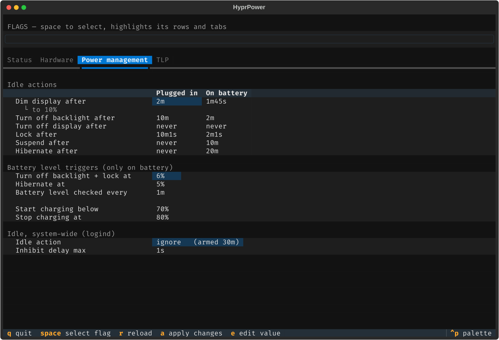

# hyprpower

One declarative power policy for a Hyprland laptop.



## Why

Nothing on a Wayland laptop owns power policy. It is spread across four
daemons with four config languages, and none of them agrees with the others:

| | splits by AC / battery? |
|---|---|
| hypridle — idle timeouts | **no** ([issue #67](https://github.com/hyprwm/hypridle/issues/67), open) |
| logind — lid, power button | only the lid |
| acpid — ACPI events | no |
| TLP — hardware tunables | every setting |

So "dim sooner on battery" has no answer, and the settings you *can* change
are in four places that can silently disagree with each other and with what
the machine is actually doing.

hyprpower puts the whole table in one file and compiles it:

```
profile.toml ──▶ hypridle.conf          one listener per rung per power source
             ──▶ logind drop-in         lid, power button
             ──▶ systemd sleep drop-in  suspend → hibernate delay
             ──▶ battery sysfs          charge thresholds
```

`hyprpower verify` then checks all four against the profile, because none of
them stays put: hypridle reads its config once at startup, logind caches its
own until reloaded, and TLP reasserts charge thresholds whenever it restarts.

## The profile

```toml
[idle.dim]              [lid]
ac      = "2m"          docked  = "ignore"
battery = "1m45s"       ac      = "suspend"
                        battery = "suspend"
[idle.suspend]
ac      = false         [battery.charge]
battery = "10m"         start = 70
                        stop  = 80
[idle.hibernate]
ac      = false         [button.power]
battery = "20m"         ac      = "suspend"
                        battery = "hibernate"
```

The power source is always the leaf key, everywhere. Actions are
`ignore`, `lock`, `suspend`, `hibernate`, `shutdown`; durations are `never`,
`90s`, `2m30s`, `10m`.

Set both `[idle.suspend]` and `[idle.hibernate]` on one source and they
compose: the machine suspends at the first time and systemd moves it to disk
at the second. Nothing in userspace runs while asleep, so a second listener
could never have fired — systemd does that escalation on an RTC alarm.

## What the TUI adds

Editing (`e`) writes back to the profile, comments intact. Applying (`a`)
escalates once for the system half. And it reports what it cannot fix for
you:

```
* Scheduled after the machine is already asleep, so it never runs.
      (Hibernate after = never / 20m)
* This suspend never reaches disk, so the battery can run flat.
      (Suspend after = never / 10m)
```

Both are rules over the compiled listeners rather than special cases, so any
rung scheduled after the machine sleeps is caught, not just the pair someone
thought of.

## Install

Requires Hyprland, hypridle, brightnessctl, and systemd. TLP is optional —
its tab reads as "not installed" without it.

Add the flake, then import whichever half you use. The two are independent:

```nix
inputs.hyprpower.url = "github:JDongian/hyprpower";
```

```nix
# NixOS: ACPI routing, the battery timer, re-applying at boot
imports = [ inputs.hyprpower.nixosModules.default ];
services.hyprpower = { enable = true; user = "you"; };
```

```nix
# home-manager: the hypridle unit and the executable
imports = [ inputs.hyprpower.homeManagerModules.default ];
programs.hyprpower.enable = true;
```

Then run `hyprpower` to look, and `a` to apply.

Your profile is seeded to `~/.config/hyprpower/profile.toml` from
[`hyprpower/default.toml`](hyprpower/default.toml). Point it at a file under
version control instead and the TUI writes through the symlink, so a fresh
machine rebuilds with your policy rather than the default:

```nix
programs.hyprpower.profileSource = "/etc/nixos/hyprpower/profile.toml";
```

Without Nix, `pip install .` gives you the TUI, `verify` and the `do`/`event`
subcommands — but nothing is wired up: no hypridle unit, no ACPI routing, no
battery timer. [`nix/nixos.nix`](nix/nixos.nix) and
[`nix/home-manager.nix`](nix/home-manager.nix) are the reference for what
those need to be.

## Scope

Hyprland only, and developed on one ThinkPad running NixOS. The compositor
assumptions are `hyprctl dispatch dpms` and a `hyprlock` unit; everything
else is systemd and sysfs.

MIT.
